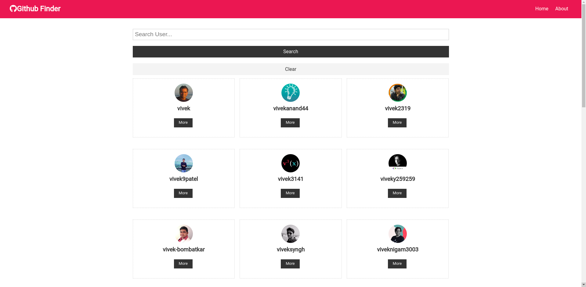

# Github-Finder

Find any github account and look at the account and the details in it also look which repos/projects they have done. Using the third party API of github to fetch all the accounts and their details

## Featutes

- View all the account in github
- Have a detailed look into the github profile of any user if its public
- Look that the repos and other details and directly visit the account on github.

## Build With

- ReactJs

## Live Demo

https://github-finder-alpha.vercel.app/

## ScreenShots

#### Front Page

#### Search Result

#### More Details

